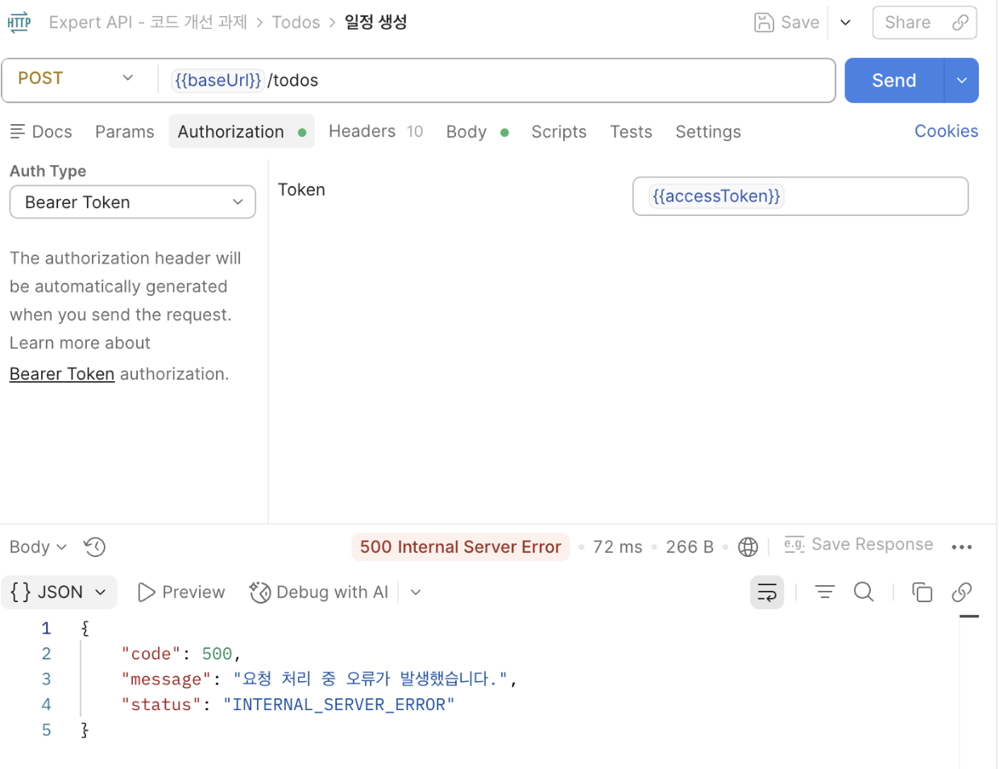
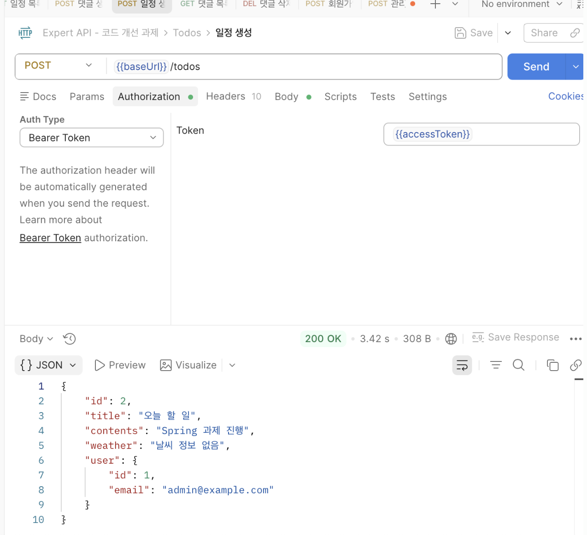

# 코드개선과제 Lv6

위 제시된 기능 이외 ‘내’가 정의한 문제와 해결 과정

---

# 코드개선 1번

## 1. 문제 인식 및 정의

### 문제

회원가입 시 JWT 토큰을 반환해주는 문제가 있다.

### 사유

토큰은 로그인 시 발행하여 사용자의 인증(Authentication) 및 인가(Authorization)에 사용된다.
회원가입 단계에서는 토큰 발급이 필요하지 않다.

---

## 2. 해결 방안

### 2-1. 의사결정 과정

서비스 로직을 수정하여 회원가입 시 토큰 발급 코드를 제거하고,
토큰은 로그인 시에만 발급하도록 변경한다.

### 2-2. 해결 과정

Auth 도메인의 회원가입 API 서비스 로직에서 토큰 반환을 제거하였다.

#### 수정 사항

1. Controller와 Service에서 `void`를 반환하도록 수정
2. `SignupResponse` DTO 삭제

---

## 3. 해결 완료

### 3-1. 회고

토큰 반환 삭제 과정에서 회원가입 반환 DTO를 제거했는데,
향후에는 통일된 API 응답 형식을 적용하면 더 좋은 구조가 될 것 같다.

### 3-2. 전후 데이터 비교

#### 문제 해결 전

##### Controller

```java
public SignupResponse signup(@Valid @RequestBody SignupRequest signupRequest) {
    return authService.signup(signupRequest);
}
```

##### Service

```java
@Transactional
public SignupResponse signup(SignupRequest signupRequest) {

    if (userRepository.existsByEmail(signupRequest.getEmail())) {
        throw new InvalidRequestException("이미 존재하는 이메일입니다.");
    }

    String encodedPassword = passwordEncoder.encode(signupRequest.getPassword());

    UserRole userRole = UserRole.of(signupRequest.getUserRole());

    User newUser = new User(
            signupRequest.getEmail(),
            encodedPassword,
            userRole
    );

    User savedUser = userRepository.save(newUser);

    String bearerToken =
            jwtUtil.createToken(savedUser.getId(), savedUser.getEmail(), userRole);

    return new SignupResponse(bearerToken);
}
```

---

#### 문제 해결 후

##### Controller

```java
public void signup(@Valid @RequestBody SignupRequest signupRequest) {
    authService.signup(signupRequest);
}
```

##### Service

```java
@Transactional
public void signup(SignupRequest signupRequest) {

    if (userRepository.existsByEmail(signupRequest.getEmail())) {
        throw new InvalidRequestException("이미 존재하는 이메일입니다.");
    }

    String encodedPassword = passwordEncoder.encode(signupRequest.getPassword());

    UserRole userRole = UserRole.of(signupRequest.getUserRole());

    User newUser = new User(
            signupRequest.getEmail(),
            encodedPassword,
            userRole
    );

    userRepository.save(newUser);
}
```

---

# 코드개선 2번

## 1. 문제 인식 및 정의

### 문제

인터넷 미연결 시 외부 날씨 API 의존성 때문에 Todo 생성이 실패한다.

### 사유

일정 생성 시 외부 날씨 API를 호출하여 날씨 정보를 저장하는데,
인터넷이 연결되지 않은 경우 서버 에러가 발생하였다.

---

## 2. 해결 방안

### 2-1. 의사결정 과정

외부 API 실패가 서비스 전체 실패로 이어지지 않도록 예외 처리를 적용한다.

### 2-2. 해결 과정

일정 생성 API 서비스 로직에서 `try-catch`를 사용하여
날씨 API 호출 실패 시 `"날씨 정보를 불러올 수 없습니다."`를 저장하도록 수정하였다.

---

## 3. 해결 완료

### 3-1. 회고

주말에 카페에서 맥북으로 공부하던 중,
카페 와이파이가 끊기면서 발견한 문제였다.

오류는 예상하지 못한 환경에서 발견될 수 있다는 점을 경험했다.

만약 집에서 안정적인 인터넷 환경으로만 개발했다면
놓칠 수 있었던 문제였다.

### 3-2. 전후 데이터 비교

#### 문제 해결 전

```java
public TodoSaveResponse saveTodo(AuthUser authUser, TodoSaveRequest todoSaveRequest) {

    User user = User.fromAuthUser(authUser);

    String weather = weatherClient.getTodayWeather();

    Todo newTodo = new Todo(
            todoSaveRequest.getTitle(),
            todoSaveRequest.getContents(),
            weather,
            user
    );

    Todo savedTodo = todoRepository.save(newTodo);

    return new TodoSaveResponse(
            savedTodo.getId(),
            savedTodo.getTitle(),
            savedTodo.getContents(),
            weather,
            new UserResponse(user.getId(), user.getEmail())
    );
}
```

#### 포스트맨 화면



---

#### 문제 해결 후

```java
@Transactional
public TodoSaveResponse saveTodo(
        AuthUser authUser,
        TodoSaveRequest todoSaveRequest
) {

    User user = User.fromAuthUser(authUser);

    String weather;

    try {
        weather = weatherClient.getTodayWeather();
    } catch (Exception e) {
        weather = "날씨 정보를 불러 올 수 없습니다.";
    }

    Todo newTodo = new Todo(
            todoSaveRequest.getTitle(),
            todoSaveRequest.getContents(),
            weather,
            user
    );

    Todo savedTodo = todoRepository.save(newTodo);

    return new TodoSaveResponse(
            savedTodo.getId(),
            savedTodo.getTitle(),
            savedTodo.getContents(),
            weather,
            new UserResponse(user.getId(), user.getEmail())
    );
}
```

#### 포스트맨 화면

